# Last War Alliance Manager (Anno 2193) — Architecture Diagrams

These diagrams are written in [Mermaid](https://mermaid.js.org/). They render
automatically on GitHub, in IntelliJ IDEA (with the *Mermaid* plugin), and in
VS Code (with *Markdown Preview Mermaid Support*). See
[How to render / regenerate](#how-to-render--regenerate) at the bottom.

- [1. Layered architecture overview](#1-layered-architecture-overview)
- [2. Class diagram (whole application)](#2-class-diagram-whole-application)
- [3. Sequence diagrams (per controller endpoint)](#3-sequence-diagrams-per-controller-endpoint)

---

## 1. Layered architecture overview

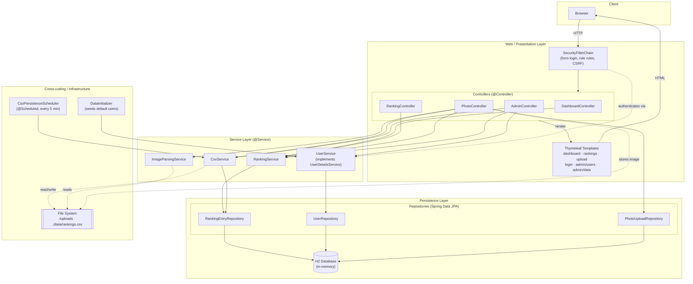

**Layer responsibilities**

| Layer | Components | Responsibility |
|-------|-----------|----------------|
| Web | `*Controller`, `SecurityConfig`, Thymeleaf templates | HTTP routing, auth rules, view rendering |
| Service | `RankingService`, `UserService`, `CsvService`, `ImageParsingService` | Business logic, transactions, OCR/CSV orchestration |
| Persistence | `*Repository`, H2 | CRUD + derived queries, storage |
| Infra | `DataInitializer`, `CsvPersistenceScheduler`, file system | Bootstrapping, scheduled CSV export, blob/CSV storage |

---

## 2. Class diagram (whole application)

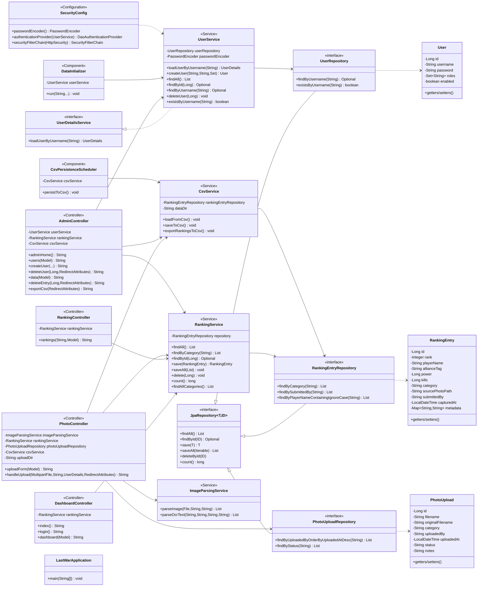

---

## 3. Sequence diagrams (per controller endpoint)

Every browser request first passes through the Spring Security
`SecurityFilterChain`. Role requirements (from `SecurityConfig`) are noted per
endpoint. To keep the diagrams readable, the filter chain is shown explicitly in
the first diagram and abbreviated as a note thereafter.

### 3.1 `GET /` — DashboardController.index

`VIEWER+` · redirects to the dashboard.

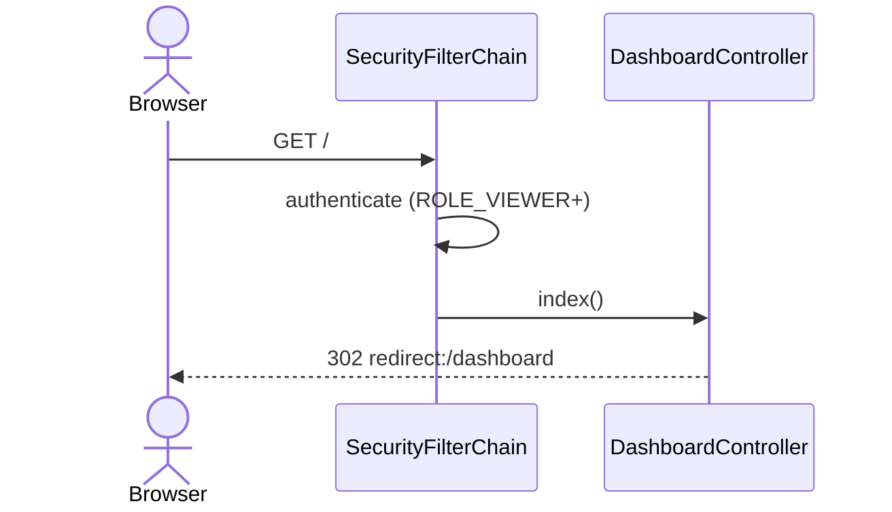

### 3.2 `GET /login` — DashboardController.login

Public (permitAll).

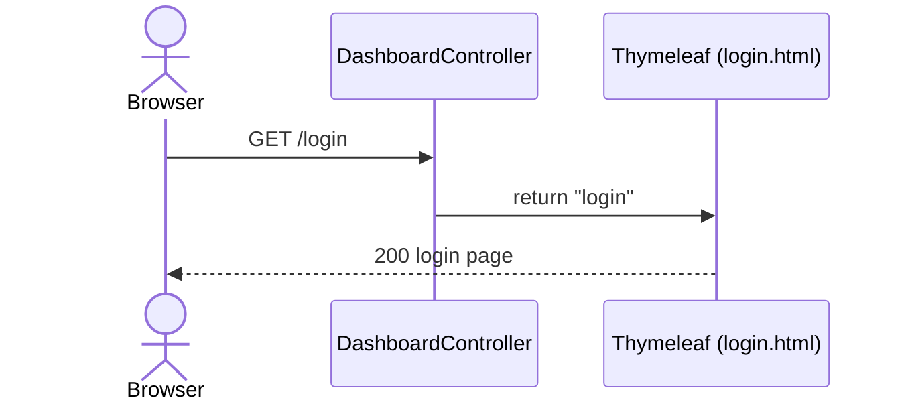

### 3.3 `GET /dashboard` — DashboardController.dashboard

`VIEWER+`.

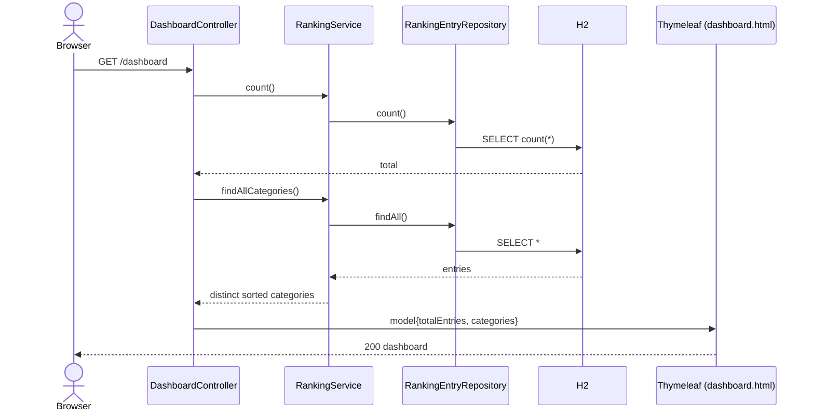

### 3.4 `GET /rankings` — RankingController.rankings

`VIEWER+` · optional `?category=` filter.

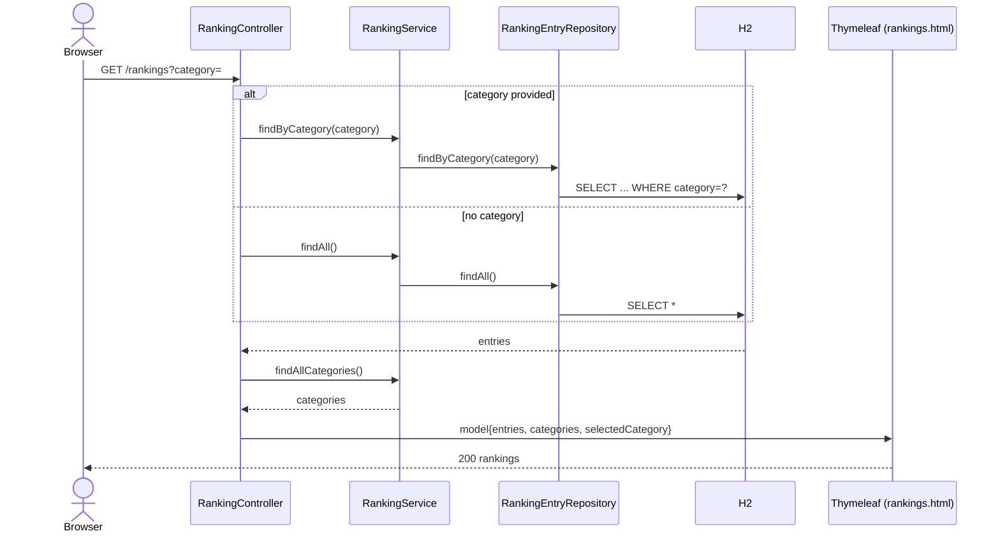

### 3.5 `GET /upload` — PhotoController.uploadForm

`SUBMITTER` or `ADMIN`.

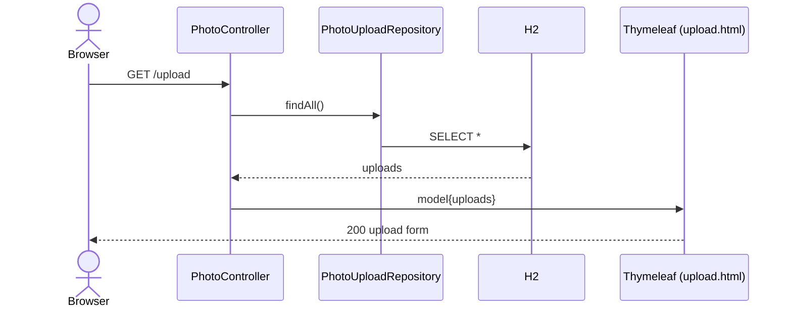

### 3.6 `POST /upload` — PhotoController.handleUpload

`SUBMITTER` or `ADMIN` · file + category, runs the full ingest pipeline.

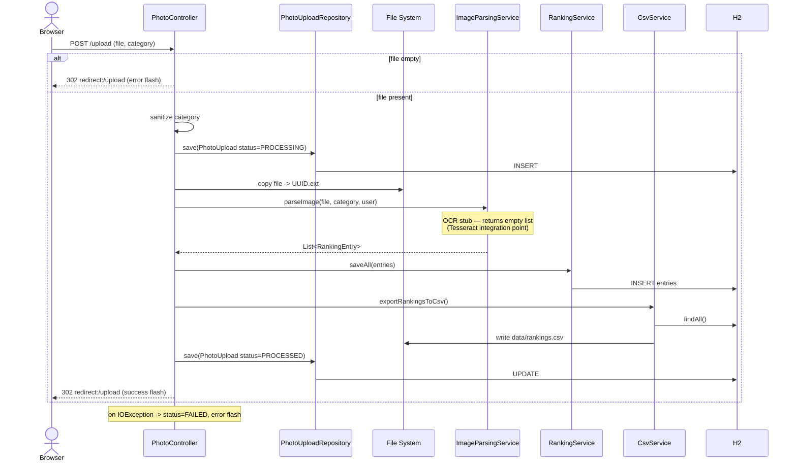

### 3.7 `GET /admin` — AdminController.adminHome

`ADMIN` only · redirects to user management.

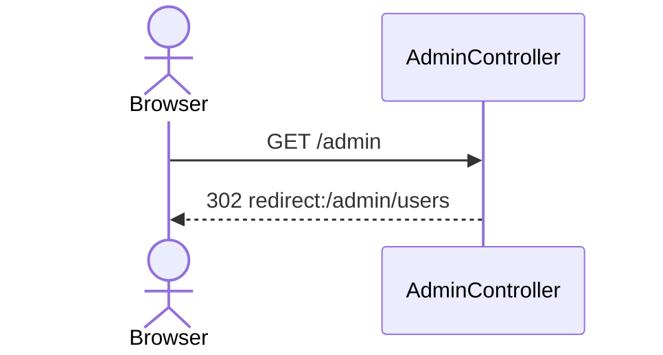

### 3.8 `GET /admin/users` — AdminController.users

`ADMIN` only.

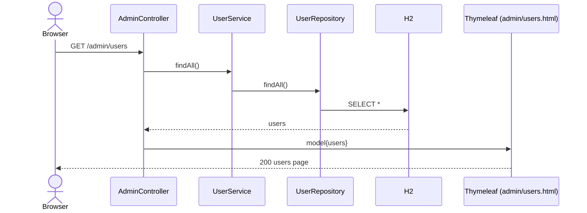

### 3.9 `POST /admin/users/create` — AdminController.createUser

`ADMIN` only.

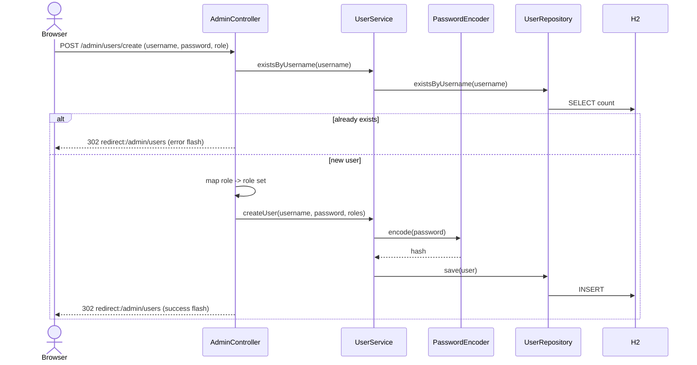

### 3.10 `POST /admin/users/delete/{id}` — AdminController.deleteUser

`ADMIN` only.

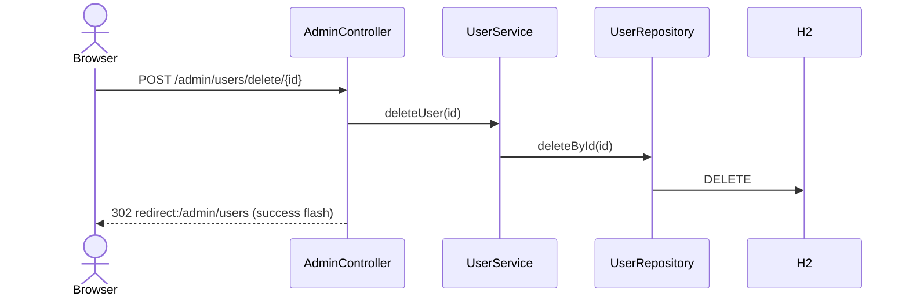

### 3.11 `GET /admin/data` — AdminController.data

`ADMIN` only.

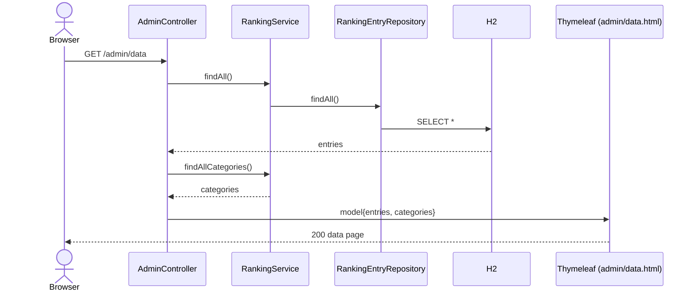

### 3.12 `POST /admin/data/delete/{id}` — AdminController.deleteEntry

`ADMIN` only.

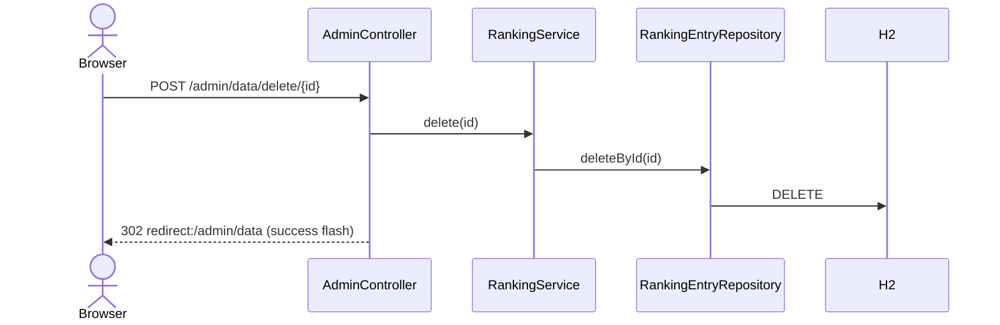

### 3.13 `POST /admin/data/export` — AdminController.exportCsv

`ADMIN` only.

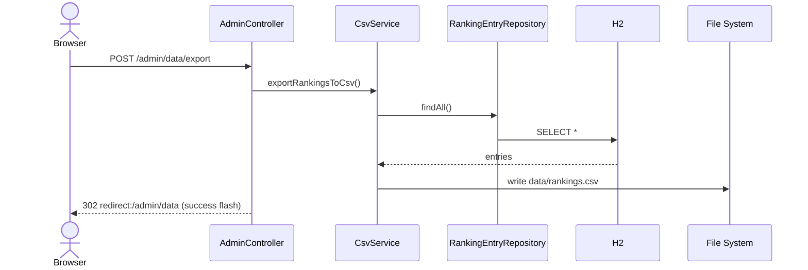

---

## How to render / regenerate

**View the diagrams**
- **GitHub** — just open this `.md` file; Mermaid blocks render automatically.
- **IntelliJ IDEA** — install the *Mermaid* plugin (Settings → Plugins), then open the Markdown preview.
- **VS Code** — install *Markdown Preview Mermaid Support*, then `Ctrl+Shift+V`.

**Export to PNG/SVG/PDF** with the Mermaid CLI:
```bash
npm install -g @mermaid-js/mermaid-cli
# Render every diagram in this file to numbered PNGs:
mmdc -i docs/architecture.md -o docs/architecture.png
```

**Keep them in sync as the code changes**
- The diagrams are hand-derived from the source. After adding a controller
  endpoint, service, or entity, update the relevant block here.
- To auto-generate a class diagram from bytecode instead, consider
  [PlantUML](https://plantuml.com/) with a Java parser, or the IntelliJ
  *Diagrams → Show Diagram* feature on the `com.lastwar.ano2193` package
  (Ultimate edition) for an always-accurate UML class diagram.
